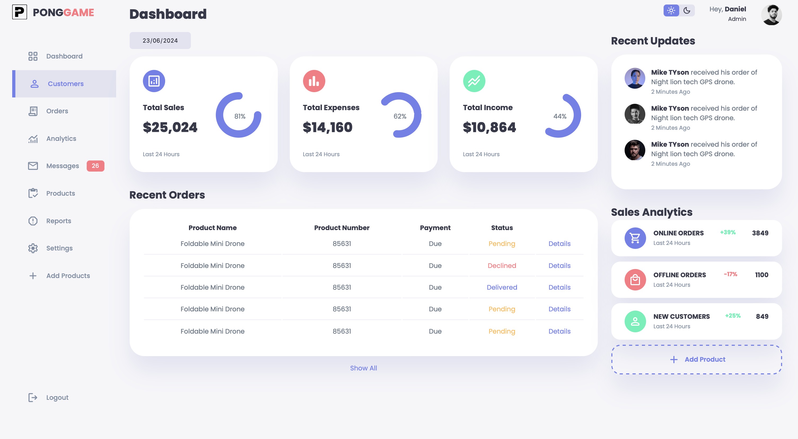

# Responsive Admin Dashboard Using HTML, CSS & JavaScript with Light & Dark Mode

## Reference

[Watch the tutorial on YouTube](https://youtu.be/BOF79TAIkYQ?si=73HZSvwYaehJc_O7)

## Icon

[Google Fonts Icons](https://fonts.google.com/icons)

## Font

[Poppins on Google Fonts](https://fonts.google.com/specimen/Poppins?query=pop)

## Preview

