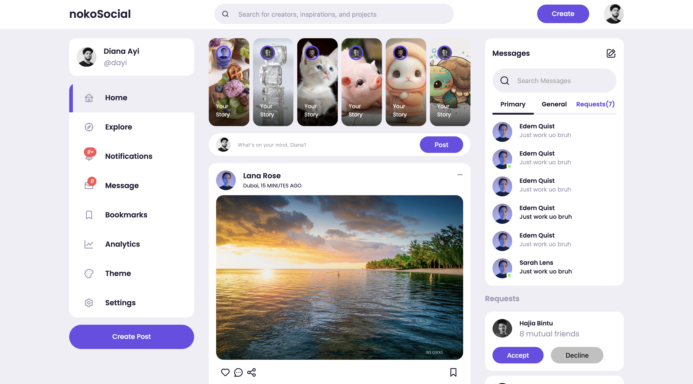

# Responsive Social Media Website With Theme Customization Using HTML CSS & JavaScript

## Reference

[Watch the tutorial on YouTube](https://youtu.be/AiFfDjmd0jU?si=iOJcQwt5n4y22dYm)

## Icon

- [Unicons Getting Started](https://iconscout.com/unicons/getting-started/line)
- [Unicons Free Line Icon Fonts](https://iconscout.com/unicons/free-line-icon-fonts)

## Font

[Poppins on Google Fonts](https://fonts.google.com/specimen/Poppins?query=pop)

